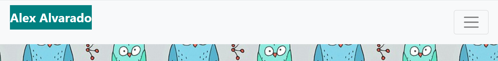
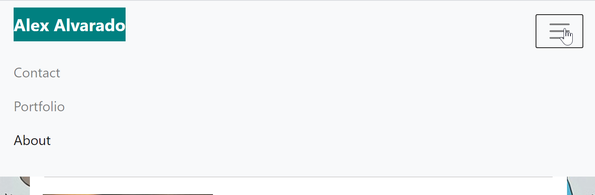
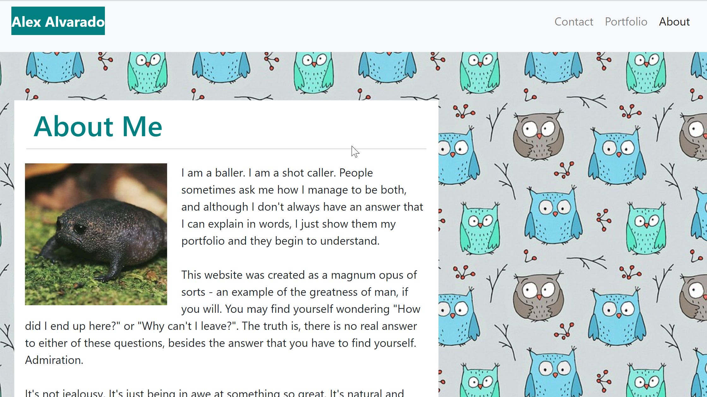

# Mobile-Responsive-Portfolio
##Portfolio website with code to adjust for mobile devices. 

A portfolio website is necessary to display work in an accessible and device responsive manner. The website contains three basic functions of a portfolio:an about section, a contact section, and a portfolio page.
Every page includes a footer for copyright and consistency, as well as a clean look. 
The navbar is consistent on every page. It allows users to go back and forth between the three pages and removes redundancy from navigating to the page they are currently on. 
Page sections are semantically labeled, images are alt tagged. The page is responsive to screen size changes and maintains a clean look on even large or very small pages.  

https://alexjalva.github.io/Mobile-Responsive-Portfolio/

##Installation

https://github.com/Alexjalva/Mobile-Responsive-Portfolio.git

All files needed are contained within the repository. The main folder needs to include the assets folder and all 3 html files. As long as all files are included, and placed in that order, the html should be able to find the images based on relative path. 

##Usage

###How to access the page
Webpage can be loaded based off of html in main repository. 

### How to Navigate the Website

The navbar has a brand on the left that is not clickable. The right side of the navbar, when expanded, will have three buttons. The button for the active page will not be clickable, the other two buttons will. 

Format: ![NavBar Expanded Usage]

The navbar will become compact on smaller screens and will instead have a burger menu where the links previously were. The burger menu can be clicked on to access the other links as seen below.

Format: ![NavBar Compact Look]

Format: ![NavBar Burger Menu Usage]

###How to view the content
The content will be viewable on each page, and will resize depending on screen size. See below for examples of page at different screen sizes. 

Format: ![How the page looks at full screen size]

Format: ![How the page looks at smaller screen sizes]

##Credits
Original page was created by Alexander Alvarado

##License
MIT License

Copyright (c) 2020 Alexander Alvarado 

Permission is hereby granted, free of charge, to any person obtaining a copy
of this software and associated documentation files (the "Software"), to deal
in the Software without restriction, including without limitation the rights
to use, copy, modify, merge, publish, distribute, sublicense, and/or sell
copies of the Software, and to permit persons to whom the Software is
furnished to do so, subject to the following conditions:

The above copyright notice and this permission notice shall be included in all
copies or substantial portions of the Software.

THE SOFTWARE IS PROVIDED "AS IS", WITHOUT WARRANTY OF ANY KIND, EXPRESS OR
IMPLIED, INCLUDING BUT NOT LIMITED TO THE WARRANTIES OF MERCHANTABILITY,
FITNESS FOR A PARTICULAR PURPOSE AND NONINFRINGEMENT. IN NO EVENT SHALL THE
AUTHORS OR COPYRIGHT HOLDERS BE LIABLE FOR ANY CLAIM, DAMAGES OR OTHER
LIABILITY, WHETHER IN AN ACTION OF CONTRACT, TORT OR OTHERWISE, ARISING FROM,
OUT OF OR IN CONNECTION WITH THE SOFTWARE OR THE USE OR OTHER DEALINGS IN THE
SOFTWARE.